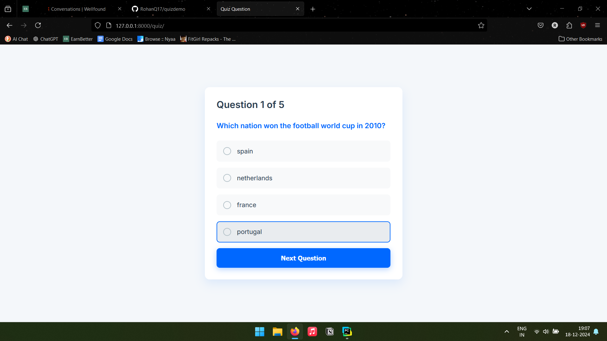
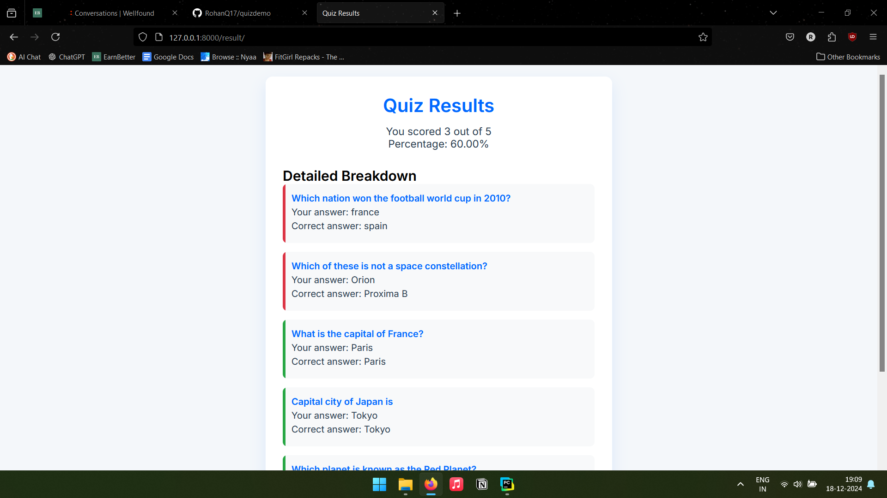

# Django Quiz App
.png)


## Overview
This is a simple Django-based quiz application that allows users to take a randomized 5-question quiz. The app selects questions randomly from a database, presents them one by one, and provides a detailed results page showing the user's performance.

## Features
- Randomly select 5 questions from the database
- Multiple-choice question format
- Immediate feedback after completing the quiz
- Detailed results page showing:
  - Total score
  - Percentage correct
  - Breakdown of each question
- Option to retake the quiz

## Prerequisites
- Python 3.8+
- Django 3.2+
- pip (Python package manager)

## Setup Instructions

### 1. Clone the Repository
```bash
git clone https://github.com/yourusername/django-quiz-app.git
cd django-quiz-app

# On Windows
python -m venv venv
venv\Scripts\activate

# On macOS/Linux
python3 -m venv venv
source venv/bin/activate

```

### 2. Install Dependencies
```bash
pip install -r requirements.txt
```

### 3. Configure Database
```bash
# Apply migrations
python manage.py makemigrations
python manage.py migrate
```

### 4. Load questions 
```bash
# Method 1: Using management command
python manage.py load_questions
```

### 5. Run the server
```bash
Python manage.py runserver
```


